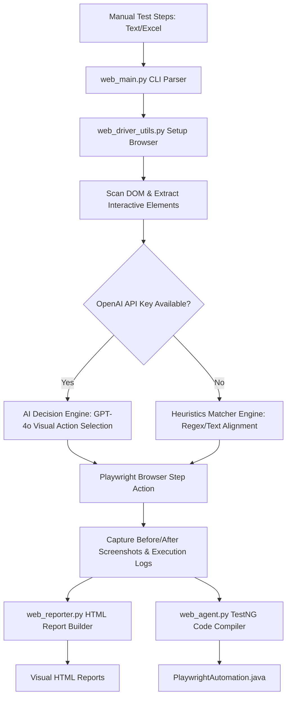

# WebAgent: Autonomous QA Test Automation & Code Generation User Guide

WebAgent is a state-of-the-art, AI-driven QA Automation Agent that parses manual web test cases (written in plain English text or structured Excel spreadsheets), executes them autonomously in a browser using Playwright, and compiles them into clean, structured, and ready-to-run Playwright Java (TestNG) code alongside gorgeous step-by-step visual HTML execution reports.

---

## Table of Contents
1. [System Architecture](#system-architecture)
2. [Prerequisites & Environment Setup](#prerequisites--environment-setup)
3. [Running WebAgent via CLI](#running-webagent-via-cli)
4. [Test Case Formats](#test-case-formats)
5. [Autonomous Engine: AI vs. Heuristics](#autonomous-engine-ai-vs-heuristics)
6. [DOM Inspection & Smart Mock Data Generation](#dom-inspection--smart-mock-data-generation)
7. [Analyzing Execution Outputs](#analyzing-execution-outputs)
8. [Integrating Generated Java/TestNG Code](#integrating-generated-javatestng-code)
9. [Crawler Mode (Recursive Site Search)](#crawler-mode-recursive-site-search)
10. [Model Context Protocol (MCP) Server Integration](#model-context-protocol-mcp-server-integration)

---

## System Architecture

WebAgent bridges the gap between natural language test cases and robust, production-ready automated Playwright test suites. The execution flow consists of the following core stages:



---

## Prerequisites & Environment Setup

### 1. Python Environment Setup
WebAgent requires **Python 3.8 or higher**. It is recommended to run inside a virtual environment to prevent dependency conflicts.

```bash
# Clone or navigate to the WebAgent project directory
cd /Users/parker.m/eclipse-workspace/WebAgent

# Create a virtual environment
python3 -m venv venv

# Activate the virtual environment
source venv/bin/activate
```

### 2. Install Project Dependencies
Install all required libraries using the [requirements.txt](file:///Users/parker.m/eclipse-workspace/WebAgent/requirements.txt) file:

```bash
pip install -r requirements.txt
```

The core libraries configured in [requirements.txt](file:///Users/parker.m/eclipse-workspace/WebAgent/requirements.txt) include:
* `playwright`: Powers browser launching, DOM actions, and screenshots.
* `openai`: Connects to OpenAI GPT models for smart action determination and visual reasoning.
* `python-dotenv`: Automatically loads local configuration from environment variables.
* `openpyxl`: Ingests and parses manual test cases from Excel worksheets.
* `mcp`: Implementation of the Model Context Protocol (MCP) server.

### 3. Initialize Playwright Browser Binaries
Playwright requires browser binaries to execute. Run the following command to download the default Chromium compiler binaries:

```bash
playwright install chromium
```

> [!NOTE]
> If these binaries are missing at runtime, the browser setup script [web_driver_utils.py](file:///Users/parker.m/eclipse-workspace/WebAgent/web_driver_utils.py) will automatically attempt to install them on the fly.

### 4. Configure OpenAI API Credentials (Optional but Recommended)
For high-accuracy visual execution and complex multi-step forms, provide an OpenAI API Key. Create a `.env` file in the project root:

```env
OPENAI_API_KEY=your-actual-api-key-here
```

---

## Running WebAgent via CLI

The primary execution entry point is [web_main.py](file:///Users/parker.m/eclipse-workspace/WebAgent/web_main.py). You pass the initial starting URL and a comma-separated list of test cases.

```bash
python3 web_main.py --url "<initial_url>" --testcase <path_to_testcase_file> [options]
```

### Command Line Arguments Reference

| Argument | Required | Default | Description |
| :--- | :---: | :---: | :--- |
| `--url` | **Yes** | — | Starting target web page URL (e.g., login, onboarding, or home page). |
| `--testcase` | No | — | Path to a text (`.txt`) or Excel (`.xlsx`/`.xls`) file containing steps. Optional if `--crawl-search` is specified. |
| `--output-java` | No | `PlaywrightAutomation.java` | Path to save the final compiled unified Playwright Java/TestNG class. |
| `--output-report` | No | `web_report.html` | Base file path where the visual HTML report will be generated. |
| `--headless` | No | `False` | Run the browser invisibly in headless mode (default: False/headed, showing the browser). |
| `--model` | No | `gpt-4o` | The OpenAI GPT model to call for visual decisions (default: `gpt-4o`). |
| `--crawl-search` | No | — | Word/phrase to search recursively across the entire site's DOM. Activates Crawler Mode. |
| `--crawl-max-pages`| No | `20` | Maximum number of pages to crawl during Crawler Mode. |

### Command Examples

**Running a headed local execution of a text test case:**
```bash
python3 web_main.py --url "https://www.saucedemo.com/" --testcase test_steps.txt
```

**Running multiple spreadsheet-based suites in headless mode:**
```bash
python3 web_main.py --url "https://example.com/portal" --testcase standard_testcase.xlsx,multi_testcase.xlsx --headless
```

---

## Test Case Formats

WebAgent supports test cases written in natural plain language, either in unstructured text files or structured spreadsheets.

### 1. Plain Text Format (`.txt`)
Each line represents a manual test step. Leading bullet points (`-`, `*`) or numbers are ignored. Empty lines or lines starting with `#` are ignored as comments.

Example [test_steps.txt](file:///Users/parker.m/eclipse-workspace/WebAgent/test_steps.txt):
```text
# Saucedemo Purchase Flow Test
Type "standard_user" in username input
Type "secret_sauce" in password input
Click login button
Verify page title contains "Swag Labs"
Verify product title "Sauce Labs Backpack" is visible
Click on the menu drawer button
Click on the "Logout" sidebar link
```

### 2. Excel Spreadsheets (`.xlsx` or `.xls`)
WebAgent scans the active sheet in the workbook to detect test case rows:
* It looks for columns with headers containing terms like: `test steps`, `test step`, `steps`, `action`, `actions`.
* It optionally looks for description headers matching: `description`, `name`, `test case description`, `title`, `summary`.
* Each row containing a description and a sequence of steps is automatically parsed as an independent test case.

> [!TIP]
> If a cell contains multiple lines (ALT+Enter in Excel), WebAgent will parse each line in that cell as a sequential step inside the same test case execution.

---

## Autonomous Engine: AI vs. Heuristics

When WebAgent processes a step, it scans the DOM structure and matches it with the current step. It can operate in two modes:

### A. OpenAI Decision Loop (AI Engine)
When `OPENAI_API_KEY` is present, WebAgent calls OpenAI's model. For every step, WebAgent compiles:
1. The manual step description.
2. A JSON schema of all visible, interactive DOM elements.
3. A base64-encoded screenshot of the current page viewport.

The AI model behaves as a visual QA engine and responds with a structured JSON action command specifying:
* The exact `action` to perform (e.g. `click`, `fill`, `select`, `check`, `navigate`, `verify`, `done`).
* The targeted `element_id`.
* The `value` (if filling or selecting).
* A detailed `reasoning` justification that is recorded in logs and reports.

### B. Regex Heuristics Engine (Fallback Engine)
If no API key is configured (or if the OpenAI connection fails), WebAgent falls back to a locally computed Heuristic Matcher:
* **Fuzzy String Matcher:** Scans labels, placeholders, element texts, class names, and tag attributes against keyword variations extracted from the manual step.
* **Verification Matcher:** Evaluates regex patterns to perform assertions:
  * **Page Title Verification**: Matches `verify title contains "..."` or `assert title is "..."`.
  * **Rendered Text/Element Verification**: Matches `verify "..." is visible` or `assert text "..." exists` (checks page-level elements/locators).
  * **Raw DOM HTML Verification**: Matches `verify DOM contains "..."`, `verify HTML contains "..."`, or `assert page source contains "..."` (checks raw DOM HTML string regardless of element visibility).

---

## DOM Inspection & Smart Mock Data Generation

To ensure reliable executions, the core utility module [web_driver_utils.py](file:///Users/parker.m/eclipse-workspace/WebAgent/web_driver_utils.py) handles the underlying browser logic and DOM analysis:

### 1. Element Extraction & Selector Resolution
WebAgent injects custom JavaScript into the browser runtime to inspect the active DOM. It scans for anchors, buttons, inputs, selects, textareas, elements with ARIA roles (button, link, checkbox, combobox), and `contenteditable` objects.
It generates robust Playwright-compatible locator strings by prioritizing selectors in the following order:
1. Test attributes: `data-testid`, `data-test`, `data-qa`, or `data-cy`.
2. Clean IDs: `#element-id`.
3. Combobox logic: ARIA comboboxes wrapped with labels.
4. Input names: `input[name="email"]`.
5. Button & anchor text matches: `button:has-text("Submit")`.
6. Placeholder: `input[placeholder="Enter Zip Code"]`.
7. DOM Path Fallbacks: Structured CSS tag/class combinations.

### 2. Smart Mock Data Generation
If a form field is marked as required (via HTML `required`, `aria-required`, or labeled with asterisks `*`) and the manual instruction does not specify an input value, WebAgent generates realistic mock data using `generate_mock_data` in [web_agent.py](file:///Users/parker.m/eclipse-workspace/WebAgent/web_agent.py).

It matches field label text and types to generate appropriate inputs:

| Detected Data Type | Sample Generated Value |
| :--- | :--- |
| `email` | `david.smith42@example.com` |
| `phone` / `whatsapp` | `9123456789` |
| `password` | `SecurePass589!` |
| `company` | `Vertex Tech` |
| `price` | `124.00` |
| `zipcode` | `90210` |
| `date` | `1994-08-12` |
| `address` | `742 Tech Boulevard` |

---

## Analyzing Execution Outputs

Every successful or failed run generates two key outputs: a visual report and reusable Java test automation code.

### 1. Visual HTML Reports (`web_report_*.html`)
For every test case executed, WebAgent creates a dedicated HTML report (e.g. `web_report_VerifyAdminLoginOnPartnerPortal.html`).
* **Header Summary:** Shows total execution metrics, duration, URL, and test status (PASSED/FAILED).
* **Step-by-Step Cards:** Lists each parsed step, the action taken, the final CSS selector matched, the input value utilized, and the agent's decision reasoning.
* **Dual-Pane Visual Timeline:** For each step, it displays side-by-side screenshots comparing page states **Before Action** and **After Action**. Clicking on any screenshot expands it in a fullscreen lightbox modal.
* **Code Drawer:** Features an expandable, syntax-highlighted editor drawer containing the complete compiled Playwright Java test case.

### 2. Compiled Java Test Case (`PlaywrightAutomation.java`)
At the end of a multi-test-case run, WebAgent outputs a unified TestNG test suite package. The file incorporates:
* A `@BeforeClass` method that creates a Playwright instance and launches Chromium.
* `@BeforeMethod` and `@AfterMethod` handlers that handle isolated browser context initialization, size (1280x800), and cleanup per test execution.
* Individual `@Test` methods named after the corresponding manual test case (e.g., `testVerifyAdminLoginOnPartnerPortal()`) incorporating the translated Playwright Java syntax.

---

## Integrating Generated Java/TestNG Code

You can directly import the generated [PlaywrightAutomation.java](file:///Users/parker.m/eclipse-workspace/WebAgent/PlaywrightAutomation.java) into your TestNG automation suite:

### 1. Required Maven Dependencies
Add the following dependencies to your Java project's `pom.xml`:

```xml
<dependencies>
    <!-- Microsoft Playwright -->
    <dependency>
        <groupId>com.microsoft.playwright</groupId>
        <artifactId>playwright</artifactId>
        <version>1.40.0</version>
    </dependency>

    <!-- TestNG Testing Framework -->
    <dependency>
        <groupId>org.testng</groupId>
        <artifactId>testng</artifactId>
        <version>7.8.0</version>
        <scope>test</scope>
    </dependency>
</dependencies>
```

### 2. Running in IDEs
Once the dependencies are configured, you can run the test class directly in Eclipse or IntelliJ IDEA. The play icons will appear next to `@Test` annotations, allowing individual or suite-wide executions.

---

## Crawler Mode (Recursive Site Search)

If you want to find a specific word across your entire website without writing manual step-by-step test instructions for every single page, you can activate **Crawler Mode**. 

### How it Works:
1. **Pre-Crawl Login/Setup (Optional)**: If your website requires logging in first, you can pass your login credentials file via the `--testcase` parameter. WebAgent will execute the login steps first to establish the authenticated browser session.
2. **Domain-Restricted Recursive Crawling**: Starting from the current page URL (either the initial `--url` or the URL reached after executing login steps), the agent extracts all same-domain links and crawls them using a Breadth-First Search (BFS) queue.
3. **Keyword Scanning**: On each page, the crawler checks if the target word (specified via `--crawl-search`) is present in the raw DOM HTML.
4. **Outputs**:
   - Generates a gorgeous visual HTML report: [web_crawl_report.html](file:///Users/parker.m/eclipse-workspace/WebAgent/web_crawl_report.html) summarizing all crawled URLs, titles, search status (FOUND, NOT FOUND, ERROR), and clickable full-screen screenshots.
   - Compiles a unified Playwright TestNG class to [PlaywrightAutomation.java](file:///Users/parker.m/eclipse-workspace/WebAgent/PlaywrightAutomation.java) containing dynamic test methods mapping all URLs where the word was found.

### Command Example:
**Authenticate first using a login script, then crawl up to 10 pages on the site to find the word "backpack":**
```bash
python3 web_main.py --url "https://www.saucedemo.com/" --testcase test_steps.txt --crawl-search "backpack" --crawl-max-pages 10
```

---

## Model Context Protocol (MCP) Server Integration

WebAgent includes built-in Model Context Protocol (MCP) server support via [web_mcp_server.py](file:///Users/parker.m/eclipse-workspace/WebAgent/web_mcp_server.py). This allows AI coding assistants (like Gemini, Claude, or Cursor) to call WebAgent as an execution tool during developer prompts.

### 1. Running the MCP Server
You can launch the server over stdio communication using python:

```bash
python3 web_mcp_server.py
```

All status and trace details are routed directly to `web_mcp_server.log` to prevent stdio stream pollution.

### 2. Exposed Tools
The MCP server exposes a single powerful tool: `run_autonomous_test`

* **Description:** Runs manual test steps autonomously on a web page using Heuristics or AI.
* **Input Schema:**
  ```json
  {
    "url": "https://example.com/login",
    "steps": [
      "Type 'admin' in username input",
      "Type 'password' in password",
      "Click Login button",
      "Verify text 'Welcome Admin' is visible"
    ],
    "testcase_name": "VerifyAdminLogin",
    "headless": true
  }
  ```

### 3. AI Client Setup Configuration
To add WebAgent to your AI agent client (such as Claude Desktop), add the server entry under your configuration file (usually `claude_desktop_config.json`):

```json
{
  "mcpServers": {
    "web-agent": {
      "command": "python3",
      "args": [
        "/Users/parker.m/eclipse-workspace/WebAgent/web_mcp_server.py"
      ],
      "env": {
        "OPENAI_API_KEY": "your-openai-key-here"
      }
    }
  }
}
```

When configured, the client agent can autonomously trigger browser workflows, test scenarios, verify user flows, and compile Java Playwright code on your command.

# For keyword search in entire website. (Optional: use testcase for login before crawl)
python3 web_main.py \
  --url "https://www.saucedemo.com/" \
  --testcase test_steps.txt \
  --crawl-search "backpack" \
  --crawl-max-pages 10


  ======== Plain test case
  python3 web_main.py --url "https://www.saucedemo.com/" --testcase test_steps.txt

  ======== Excel test case
  python3 web_main.py --url "https://www.saucedemo.com/" --testcase standard_testcase.xlsx

